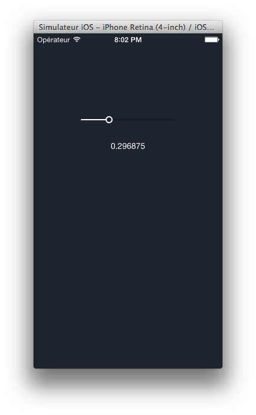

# SRGraphicSlider

SRGraphicSlider is an Objective-C user interface slider similar to embedded iOS UIKit/UISlider. It's a visual control used to select value from continuous range of values, only built with Core Graphics Framework.

Unlike embedded UIKit/UISlider, at the ends of SRGraphicSlider, **the cursor stops on its center, not on its side.**

## Installation

You can install it manually by copying these two files in your project:

	SRGraphicSlider.h
	SRGraphicSlider.m

## Usage

### Programmatically

Instanciate a new SRGraphicSlider object then add it as subview of your current view.

	- (void)viewDidLoad
	{
    	[super viewDidLoad];
    	
    	//[...]
    	
		SRGraphicSlider *slider = [[SRGraphicSlider alloc] initWithFrame:CGRectMake(0, 0, 320, 50)];
		
		slider addTarget:self action:@selector(didSliderValueChange:) forControlEvents:UIControlEventValueChanged];
		
		[self.view addSubview:slider];
    }
    
    - (void)didSliderValueChange:(SRGraphicSlider *)sender
	{
    	NSLog(@"%f", sender.value);
	}

### With XIB

Simply add an UIView with Interface Builder in your XIB and set the view class as SRGraphicSlider. Thereby, you might easily add IBOutlets and IBOutlets between the object in XIB and your view controller.

### Behavior

SRGraphicSlider is easy to use with following public properties.

For information, the background color of circle pointer is the same as the background color of the object view.

SRGraphicSlider uses ARC.

## Docs

### Public properties

#### minimumValue

Contains the minimum value of the receiver.

	@property (assign, nonatomic) CGFloat minimumValue;

**Discussion**

The default value of this property is 0.0.

#### maximumValue

Contains the maximum value of the receiver.

	@property (assign, nonatomic) CGFloat maximumValue;

**Discussion**

The default value of this property is 1.0.

#### value

Contains the receiver’s current value.

	@property (assign, nonatomic) CGFloat value;
	
**Discussion**

The default value of this property is 0.5.

#### width

Contains the width of the graphics line.

	@property (assign, nonatomic) CGFloat width;

**Discussion**

The default value of this property is equal to the frame width of the receiver view.

#### lineWidth

The line width of graphics line.

	@property (assign, nonatomic) CGFloat lineWidth;

**Discussion**

The default value of this property is 2.0.

#### radius

The radius of circle pointer.

	@property (assign, nonatomic) CGFloat radius;

**Discussion**

The default value of this property is 5.0.

#### minimumColor

Contains the minimum color of the receiver.

	@property (strong, nonatomic) UIColor *minimumColor;

**Discussion**

The default value of this property is RGB(10, 92, 255).

#### maximumColor

Contains the maximum color of the receiver.

	@property (strong, nonatomic) UIColor *maximumColor;

**Discussion**

The default value of this property is RGB(166, 166, 166).

#### cursorBackgroundColor

Contains the background color of the cursor.

	@property (strong, nonatomic) UIColor *cursorBackgroundColor;

**Discussion**

The default value of this property is RGB(255, 255, 255).

# Contact

- [Twitter](http://twitter.com/sreucherand)
- [LinkedIn](http://fr.linkedin.com/in/sylvainreucherand)